# GitHub_exercise
这个项目学习自'极客时间'苏玲老师的课程《玩转Git三剑客》.

在此感谢苏玲老师的教导.让我对git的学习打好了基础.扩展了见识.

以下是自己对这门课程的一个总结,希望对大家也有所帮助.

### 目录
<a href='#1' style='text-decoration: none;color:brown;'>一.Git基本命令</a> </br>
<a href='#2' style='text-decoration: none;color:orange'>二.独自使用Git时常用场景</a> </br>
<a href='#3' style='text-decoration: none;color:brown'>三.Git与GitHub的简单同步</a> </br>
<a href='#4' style='text-decoration: none;color:orange'>四.Git多人单分支集成协作</a> </br>
<a href='#5' style='text-decoration: none;color:brown'>五.Git集成使用禁忌</a> </br>
<a href='#6' style='text-decoration: none;color:orange'>六.初识GitHub</a> </br>
<a href='#7' style='text-decoration: none;color:brown'>七.使用GitHub进行团队协作</a> </br>
&nbsp;&nbsp;&nbsp;&nbsp;&nbsp;&nbsp;<a href='#71' style='text-decoration: none;color:gray;'>七.一 准备工作</a> </br>
&nbsp;&nbsp;&nbsp;&nbsp;&nbsp;&nbsp;<a href='#72' style='text-decoration: none;color:gray'>七.二 在Github中,将Beijing这个分支合入到main主干中</a> </br>
&nbsp;&nbsp;&nbsp;&nbsp;&nbsp;&nbsp;<a href='#73' style='text-decoration: none;color:gray'>七.三 Issues</a> </br>
&nbsp;&nbsp;&nbsp;&nbsp;&nbsp;&nbsp;<a href='#74' style='text-decoration: none;color:gray'>七.四 项目内部实施code review</a> </br>
&nbsp;&nbsp;&nbsp;&nbsp;&nbsp;&nbsp;<a href='#75' style='text-decoration: none;color:gray'>七.五 团队协作如何做多分支的集成！！</a> </br>
&nbsp;&nbsp;&nbsp;&nbsp;&nbsp;&nbsp;<a href='#76' style='text-decoration: none;color:gray'>七.六 其它</a> </br>
<a href='#8' style='text-decoration: none;color:orange'>八.Github实践</a> </br>

### 检索关键词(点击可直接跳转)
<a href='#tree' style='text-decoration: none;color:blue'>tree、commit、blog</a> &nbsp;&nbsp;&nbsp;
<a href='#.git' style='text-decoration: none;color:blue'>.git</a> &nbsp;&nbsp;&nbsp;
<a href='#.gitignore' style='text-decoration: none;color:blue'>.gitignore</a> &nbsp;&nbsp;&nbsp;
<a href='#SSH' style='text-decoration: none;color:blue'>SSH</a> &nbsp;&nbsp;&nbsp;
<a href='#fast-forword' style='text-decoration: none;color:red'>fast-forword</a> &nbsp;&nbsp;&nbsp;
<a href='#Linux' style='text-decoration: none;color:blue'>Linux</a> &nbsp;&nbsp;&nbsp;
</br>

<a href='#config' style='text-decoration: none;color:blue'>config</a> &nbsp;&nbsp;&nbsp;
<a href='#init' style='text-decoration: none;color:blue'>init add commit</a> &nbsp;&nbsp;&nbsp;
<a href='#mv' style='text-decoration: none;color:blue'>mv</a> &nbsp;&nbsp;&nbsp;
<a href='#log' style='text-decoration: none;color:blue'>log</a> &nbsp;&nbsp;&nbsp;
<a href='#branch' style='text-decoration: none;color:blue'>branch</a> &nbsp;&nbsp;&nbsp;
<a href='#checkout' style='text-decoration: none;color:blue'>checkout</a> &nbsp;&nbsp;&nbsp;
<a href='#rebase' style='text-decoration: none;color:red'>rebase</a> &nbsp;&nbsp;&nbsp;
<a href='#diff' style='text-decoration: none;color:red'>diff</a> &nbsp;&nbsp;&nbsp;
<a href='#reset' style='text-decoration: none;color:red'>reset</a> &nbsp;&nbsp;&nbsp;
<a href='#checkout(index)' style='text-decoration: none;color:blue'>checkout(index)</a> &nbsp;&nbsp;&nbsp;
</br>
<a href='#rm' style='text-decoration: none;color:blue'>rm</a> &nbsp;&nbsp;&nbsp;
<a href='#stash' style='text-decoration: none;color:red'>stash</a> &nbsp;&nbsp;&nbsp;
<a href='#tag' style='text-decoration: none;color:blue'>tag</a> &nbsp;&nbsp;&nbsp;
<a href='#sync' style='text-decoration: none;color:blue'>remote</a> &nbsp;&nbsp;&nbsp;
<a href='#clone' style='text-decoration: none;color:blue'>clone</a> &nbsp;&nbsp;&nbsp;
<a href='#fetch' style='text-decoration: none;color:blue'>fetch</a> &nbsp;&nbsp;&nbsp;
<a href='#push' style='text-decoration: none;color:blue'>push</a> &nbsp;&nbsp;&nbsp;
<a href='#merge' style='text-decoration: none;color:red'>merge</a> &nbsp;&nbsp;&nbsp;
<a href='#pull' style='text-decoration: none;color:blue'>pull</a> &nbsp;&nbsp;&nbsp;

---

## <span id="1">一.Git基本命令</span>

工作区(workspace) 暂存区(index) 版本库(.git repository) 远程仓库(remote) 
- [ ] <span id="config">**config**</span>
    - `git config --local user.name [your_name]`
    - `git config --local user.email [your_email]`
    - `git config --local --list`
    - <font color="#f00">优先级: local > global > system </font>
        - local: 区域为本仓库
        - global: 当前用户所有仓库
        - system: 本系统的所有用户
- [ ] <span id="init">**init add commit**</span>
    - 新建的项目直接用git管理
    - `git init [repository_name]` 初始化git仓库
    - `cd repository_name`
    - 进行一系列开发 change the file'变更文件'
    - `git commit -am ['commit to message']` 等同于⬇️
        - git add [change_file0 change_file2 ...] 等同于 ➡️ `git add u`
            - `git add .`: 将工作空间==新增和被修改==的文件添加到暂存区
            - `git add -u`: 将==已经被git跟踪过的文件==(先前已add的)添加到暂存区(**不包含没有纳入Git管理的新增文件**)
        - git commit -m ['commit to message']
    - ==执行commit后,会建立出一个新的commit节点(HEAD).三区内容重新保持一致.==
    - ==commit的本质==:每次Git都会用暂存区的文件创建一个新的提交,把当前的分支指向新的提交节点,这样就完成了一次新的提交。
- [ ] <span id="mv">**mv**</span>
    - `git mv [old_fileName] [new_fileName]` 等同于⬇️
        - mv readme read
        - git add read
        - git rm readme
- [ ] <span id="log">**log**</span>
    - 当前分支版本演进历史 `git log`
    - 所有分支前四次commit 单行图形化展示 (注意:不是每个分支)
        - `git log --all -n4 --online --graph`
    - 注意: 使用了--all 再指定特定分支 特定分支不会起作用
    - 查看分支所有的操作记录(包括已经删除的等): `git reflog`
    - `brew install git-gui` ; `gitk --all`
- [ ] <span id="branch">**branch**</span>
    - `git branch` 默认本地所有分支
    - `git branch -r` 远端所有分支
    - `git branch -a` 本地和远端所有分支
    - ==加上v参数== 会显示每个分支最后一个commit eg: `git branch -av`
    - `git brach -D [分支名称]` 删除不需要的分支
- [ ] <span id="checkout">**checkout**</span>
    - 创建并切换本地分支 `git checkout -b [分支名称] [基于哪里'Hash值']` 等同于 ➡️
        - `git branch [分支名称] [基于哪里'Hash值']`(不写hash,默认hash是当前HEAD)
        - `git checkout [分支名称]`
        - 选定分支A的log中某一历史commit创建新分支B(俗称*拉取特性分支*),在此基础上做开发,不会影响到A
    - 切换分支 `git checkout [分支名称]` (实质上==指向此分支最新的commit==)
    - ==简单理解:== 
        - 说某某分支就指的此分支最新的commit
        - 若切换到分支的版本演进历史的某一个旧commit,会处于*分离头指针*的状态,在上面修改后做的commit,在切换回已有分支后,大概率会被Git当作垃圾处理掉！
- [ ] <span id="tree">**tree、commit、blog**</span>
    - 问:新建的Git仓库,有且仅有一个commit,仅包含/doc/readme,请问有多少个tree,多少个blog？
    - 答:1个commit、2个tree、1个blog
    - 解释: commit本身就是一个大文件夹,里面包含很多小文件夹和文件.
        - 一个文件夹 == 一个tree ; 一个文件 == 一个blog 
- [ ] <span id=".git">**.git**</span>
    - Git的本地版本库 
    - `cat ./git/HEAD` ➡️ ref:ref/heads/fix_readme
    - `cat ref:ref/heads/fix_readme` ➡️ 750db58f0
    - `cat ./git/config` 与仓库配置的相关信息(eg:name、email等)
    - 查看存放对象的类型: `git cat-file -t [master|750db58f0]` ➡️ commit 
    - 查看存放对象里的内容: `git cat-file -p [master|750db58f0]` 
    - 查看存放对象的大小: `git cat-file -s [master|750db58f0]` 
    - 一个小问题:
        - 问: git的所有数据都在.git/objects中,每次commit,git都会把当前项目做快照保存到objects目录中。那么不断commit,其objects文件夹的大小会变得很大。
        - 答: 只要任何文件的文件内容相同,那么在Git眼中它就是唯一的blog.(即==Git对相同文件只会存一个blog==!). 其次,Git还有增量存储的机制。
- [ ] <span id="Linux">**Linux**</span>
    - 查看.git文件夹下的内容: `ls .git/ -al` 
    - 将文件m3.c复制到目录/user/studentL/tem下,并改名为m3bak.c `cp m3.c /user/studentL/tem/m3bak.c`
    - 将源目录下的所有文件及其各自子目录复制到目标位置 `cp -r ..\0-material\images .`
    - 同时创建多个目录 `mkdir dir1 dir2`
    - 指定目录下类型是文件的有多少个 `find .git/objects -type f`
    - 创建空文件f1: `touch f1`
    - 创建空文件f2并初始化内容'hi': `echo 'hi' > f2`
    - 向已有的doc文件夹里添加文件f3并初始化内容: `echo 'hi' > doc/f3`
- [ ] **其它**
    - `git help --web log` 跳转git log的帮助文档网页
    - `git reset --hard`
    - 状态 是否追踪、有无提交: <span style="color:red">`git status`</span>

---

## <span id="2">二.独自使用Git时常用场景</span>

- [ ] <span id="rebase">**rebase**</span>
    - 修改最新commit的message `git commit --amend`
    - 修改以前commit的message `git rebase -i [parent_hash值]` 修改策略为**r**
    - 将连续的commit整理成一个 `git rebase -i [parent_hash值]` 修改策略为**s**
        - 在交互的策略的设定页面 依次按照策略执行 p(B)-s(C)-s(D)-s(E)-p(F) commit
    - 将不连续的commit整理成一个 `git rebase -i --root` 修改策略为s
        - 这里修改的commit是最初始的commit 参数--root
        - 依次执行策略 p(A)-s(F)-p(橙圈)
        - 不难看出,出现了两颗独立的树,因为两分支不再拥有相同ID的commit！
    - ==注意==: 某一commit发生了变化,其自身和子孙commit的ID都会发生变化。
    - 补充: 意外退出了vi界面 别慌 `git rebase --edit-todo`继续完成编辑后 `git rebase --continue`
        
- [ ] <span id="diff">**diff**</span>
    - 明确: HEAD通常指向当前分支最新的commit.分离头指针(detached HEAD)的情况除外.
    - 注意：
        - 在未执行`git add`指令之前,可简单理解暂存区里面存放的是HEAD指针指向的内容.执行后,暂存区里修改对应的变更的部分即可。
        - 也就是说:==刚开始 working tree、index与repository(HEAD)里面的內容都是一致的==
    - `git status` **未跟踪未提交的变更文件**
    - `git diff cached` 暂存区与HEAD的比较 **未提交变更文件的内容**
    - `git diff` 暂存区与工作区的比较 **未跟踪变更文件的内容**
    - `git diff HEAD HEAD~2`==`git diff HEAD HEAD^^`比较最近和倒数第三次的提交
    - 补充: 
        - 默认比较所有的文件 可添加多个文件名比较指定的文件
        - `git diff 47183d8 47d01ac -- index.htm` 比较不同commit指定的文件
- [ ] <span id="reset">**reset**</span>
    - 感谢这篇博文:`https://www.jianshu.com/p/c2ec5f06cf1a`
    - 简单来说: reset最基本的工作就是将HEAD指向我们指定的commit！
    - 多次将工作区的同一文件添加到暂存区,会以此文件最新的变更为准
    - git reset [<mode>] [<commit>]
        - <mode> 三种形式: --mixed(默认) --hard --soft 
    - `git reset` == `git reset HEAD` ==  `git reset --mixed HEAD`
        - 工作区没影响 暂存区默认变为HEAD一样 当然可以指定恢复部分文件
    - `git reset --hard` == `git reset --hard HEAD`
        - 擦掉所有改动 工作区和暂存区默认变为HEAD一样 (版本回退到HEAD)
        - 扩展:`git reset --hard HEAD^`回退到HEAD上一个版本 HEAD～10(HEAD前第10个版本)
        - 若误操作,想撤销.挽回！
            - `git reflog`
            - `git reset --hard commit_ID` or `git cherry-pick commit_ID`
    - <span style="color:red">注意</span>: 新建的文件没有纳入版本管理,所以不管怎么reset,它都会在工作目录中！

指令 | 工作区working tree | 暂存区index stage | repository(HEAD)
---|---|---|--- 
git reset --mixed 47183d8| ==新增==原始HEAD节点与reset目标节点的差异| 同reset目标节点 | 同reset目标节点
git reset --hard 47183d8 | 同reset目标节点|⬅️|⬅️
git reset --soft 47183d8 | 没影响|==新增==原始HEAD节点与reset目标节点的差异|同reset目标节点
- [ ] <span id="checkout(index) ">**checkout**</span>
    - 将工作区的某文件恢复成暂存区的一样 `git checkout [fileName]`
    - 回退最后一次提交内容(HEAD覆盖暂存区和工作区对应文件) `git checkout HEAD [fileName]`
    - 最简单的用法 查看工作区、暂存区与HEAD的差异: `git checkout` 等同于 `git checkout HEAD` ➡️ M f1(表明对f1文件进行了修改)
- [ ] <span id="rm">**rm**</span>
    - 在工作区,直接使用`rm [fileName]`(同Linux操作)
    - 若文件已经提交版本库
        - `git rm [file_name]` 
        - `git commit -m "remove file_name"`
    - 若删除错了,使用`git checkout [filename]`进行恢复
- [ ] <span id="stash">**stash**</span>
    - 感谢这篇博文: `https://jasonkayzk.github.io/2020/05/03/Git-Stash%E7%94%A8%E6%B3%95%E6%80%BB%E7%BB%93/` 
    - <span style="color:red">注意</span>!: 在某一分支上创建的空文件夹、空文件或添加有内容的文件会出现在其它分支上(git status不会理会空文件夹)
        - 在该分支未执行commit指令(**哪怕当前已经执行了add指令**)之前都是可以checkout随意切换分支的;
        - 执行commit指令后,文件夹或文件会纳入当前分支的代码库管理,在其它分支不再会出现。
        - 综上: 新建的文件没有纳入版本管理，所以会被带到切换的分支,因而在切换分支前,最好commit一下.
    - `git stash`;`git stash save ['save_message']`
        - 对当前分支的修改内容进行存储 -> 所有未提交的修改(工作区和暂存区)保存至<span style="color:red">堆栈</span>(先进后出)中
    - `git stash list` 查看当前stash中的内容
    - `git stash pop`;`git stash pop stash@{0}`
        - 将当前stash中的内容弹出，并应用到当前分支对应的工作目录上
        - 也就是说,stash中的内容不仅仅可以恢复到原先开发的分支，也可以恢复到其他任意指定的分支上
    - `git stash apply`;`git stash apply stash@{0}`
        - 不同于pop,它不会将内容从堆栈中删除! 
    - `git stash drop stash@{0}` 从堆栈中移除某个指定的stash
    - `git stash clear` 清除堆栈中的所有内容
    - `git stash show stash@{1} -p`
        - 查看指定的stash和当前目录差异 -p详细有哪些不同
    - `git stash branch ['new_branch_name']`
        - 修改某一文件,stash后再修改,stash pop,会有冲突 ➡️ 可通过创建新的分支来解决冲突！
- [ ] <span id=".gitignore">**.gitignore**</span>
    - 指定不需要GIT管理的文件,举几个栗子:
        - `*.d` 以.d结尾的文件 ✖️
        - `*.dSYM/`
            - 若有一个名为a.dSYM文件 ☑️
            - 若有名为*.dSYM的文件夹,文件夹及文件夹下的任何文件 ✖️
        - doc 不管是文件还是文件夹 ✖️
- [ ] <span id="tag">**tag**</span>
    - 详见官方文档:`https://git-scm.com/book/zh/v2/Git-%E5%9F%BA%E7%A1%80-%E6%89%93%E6%A0%87%E7%AD%BE` 
    - 添加标签
        - 指定分支历史commit `git tag -a v1.0 47183d8 -m "my version 1.0"`
        - 当前分支最新commit `git tag -a v1.0`
        - 远程仓库添加标签 
            - `git push origin v1.0`
            - `git push origin --tags`(推送本地所有标签至远端)
    - 查看标签
        - 有哪些标签 `git tag --list`;
        - 标签具体内容 `git show v1.0`
    - 删除标签
        - 删除本地标签(并不会在任何远程仓库中移除) `git tag -d <tagname>`
        - 删除远程标签 `git push origin --delete <tagname>`
    - <span style="color:red">注意</span>!:`git reset --hard v1.0`
    - 可以在github上创建 Release给标签添加具体的说明！！
- [ ] **三区转换** ⭐️
    - 当index暂存区为空时: 
        - `git checkout HEAD filename` == `git checkout filename`     
        - `git diff` == `git diff HEAD`
        - 
---

## <span id="3">三.Git与GitHub的简单同步</span>
- [ ] <span id="SSH">**配置公私钥 SSH**</span>
    - 官方步骤: `https://docs.github.com/cn/github/authenticating-to-github/connecting-to-github-with-ssh` 
    - 生成新 SSH 密钥并添加到 ssh-agent
    - 新增 SSH 密钥到 GitHub 帐户
    - 效果: SSH协议配置好后,用户在做push操作的时候就不需要输入用户名和密码啦.它能智能识别你是谁,允许你往对应的Github账户发起变更.
- [ ] <span id="sync">**简单同步 remote**</span>
    - 创建自己的项目 `OnePieceDC/git_learning`
    - 把本地仓库同步到Github
        - 本地添加远程仓库地址: 
            - `git remote add github git@github.com:OnePieceDC/git_learning.git`
        - 查看现有远程地址的url: `git remove -v`
        - 将本地仓库推送到远端: `git push github --all`

---

## <span id="4">四.Git多人单分支集成协作</span>
#### 准备工作（码农A with 码农B）
- 码农B(suling)
    - 新建项目`git_learning`直接用git管理 <a href='#init' style='text-decoration: none;color:pink'>链接</a>
    - 本地与GitHub进行简单同步 <a href='#sync' style='text-decoration: none;color:pink'>链接</a>
        - <span style="color:red">注意</span>:**这里添加的远程仓库地址名称为 github. (默认是origin)** 
    - 在GitHub项目中基于main主干新建分支 `fearure/add_git_commands`
        - 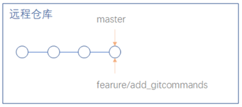 
    - 基于远端(**github**)的分支创建本地分支
        - <span style="color:red">从远程跟踪分支检出本地分支会自动创建所谓的“跟踪分支”,跟踪分支是与远程分支有直接关系的本地分支！</span>
        - 将服务器上的远端分支拉取到本地 <span id="fetch">**`fetch`**</span>
            - `git fetch github`
            - 解释: fetch会将本地的远端分支跟服务器上的远端分支保持一致！(建立或更新远程跟踪分支)
        - `git checkout -b feature/add_git_commands github/feature/add_git_commands` 
        - 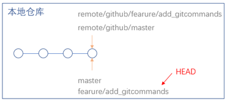
- 码农A(OnePieceDC)
    - 将该项目的主干main通过SSH协议从GIT服务器克隆到本地 <span id="clone">**`clone`**</span>
        - `git clone git@github.com:OnePieceDC/git_learning.git git_learning_02` ==注==: clone时指定文件夹名字 git_learning_02
        - `git clone`指令拉取所有数据,并在本地创建对应的本地远程分支
    - 针对本仓库设置用户名和邮箱 <a href='#config' style='text-decoration: none;color:pink'>链接</a>
    - 基于远端(**origin**)的分支创建本地分支
        - 因为我们在本地无法直接在clone下来的远程分支上做变更(建议名字一样!)
        - `git checkout -b feature/add_git_commands origin/feature/add_git_commands`
        - <span style="color:red">顺带提一句:很关键</span> 此时本地和远端的这两个分支建立了fast-forword关系！！这时候,它们的HASH值是一样的！
        - 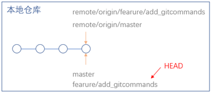
- <span id="fast-forword">**fast-forword**</span>
    - 举个栗子:本地分支往远端分支做push操作,如果远端分支不是这个本地分支的祖先,那它两就不是fast- forward关系。反之异然。
    - 我们把fast-forward通俗地说：commit和commit之间，子commit有一个箭头指向父commit，用这种方式，版本演变的历史就会形成一幅带方向的图。把commit比做人的话，孙子和爷爷之间，儿子和爸爸之间就是fastforward的关系，而堂兄之间就不是fastforward的关系了。
    - 官网解释：fast-forward是merge的一种特殊类型，你把A分支合入到B分支的时候，恰好B分支指向的commit是A分支的祖先，在这种情况下，我们无需额外创建一个merge的commit，而只需把B分支指向A分支对应的commit就行。

#### 协同开发
##### 情况一: AB修改了不同的文件
- 码农A修改了`readme.md`,并push推送到远端 <span id="push">**push**</span>
    - `vi readme.md`;`git add -u`;`git commit -m'Add git commands desc'`
    - `git push [远程主机名] [本地分支名]:[远程分支名]`使用某本地分支并推送它以更新对应的远程分支
        - `git push origin feature/add_git_commands:feature/add_git_commands` 
        - 这里缺省的是remote就是origin,在创建本地分支的时候就与远端分支建立了fast-forword的关系. 
        - ==因而这里可简写==：`git push`
        - 补充: `git push`不加参数只能上传到从远程仓库clone或者pull下来的分支,如需push在本地创建的分支则需使用`git push origin [分支名]`
- 码农B修改了index.html
    -  `vi index.html`;`git add -u`;`git commit -m'Add git commands in index'`
    -  执行到这一步,你会发现远端feature分支Hash为25g40,而B码农的本地分支feature远端跟踪分支的Hash停留在190a3
    -  所以执行`git push github`;会报错 ->本地跟远端的分支不是fast-forwards关系！
        - 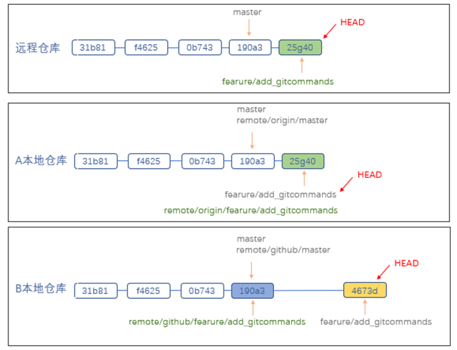
    - 解决方案:
        - `git fetch github`
        - `git merge 25g40`==合并指定分支到当前分支== <span id="merge">**merge**</span>
            - 若当前分支master与指定分支dev是fast-forword的关系 会采取'快进'模式,直接把master指向dev的当前提交
                - 任何新的功能或bug修复全都新建一个branch来写；
                - branch写完后,合并到master,然后删掉这个 branch（可使用git origin -d 分支名删除远程仓库的分支）
            - 若不是fast-forword的关系 则会通过两分支产生一个新的commit(它具有两个父节点)
            - 分支合并也会有失败的情况,当你的两条分支都修改的相同的文件,这时候Git就无法判断你要保留哪一个修改,就会出现merge冲突(当前是AB修改不同的文件,不存在合并冲突)
                - 有冲突,需要手动解决掉冲突并重新add、commit（==改动不同文件或同一文件的不同行都不会产生冲突==）
                - 有冲突,也可以使`git merge --abort`放弃解决冲突，取消merge
        - `git push`
        - ==纠正一下: 橘色的commit的hash值是要变的！！制图的时候疏忽了。==
        - 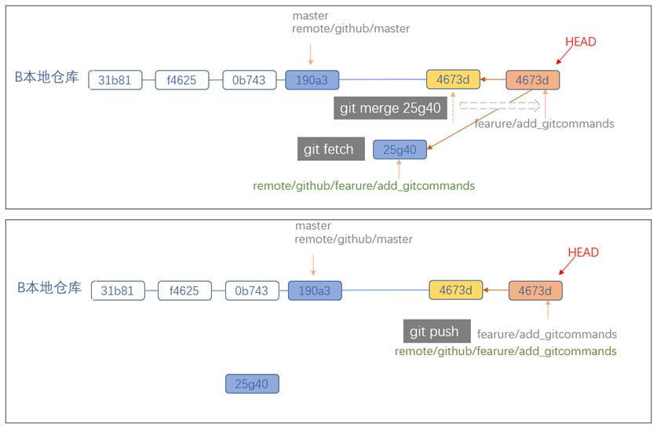
        - 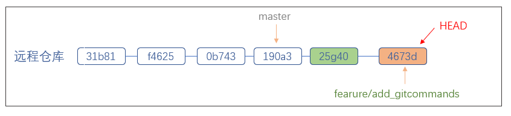

##### 情况二: AB修改了相同的文件不同区域
- 首先执行`git pull`指令,本地与远端进行同步(把远程仓库新的提交拉取到本地) <span id="pull">**pull**</span>
    - git pull <远程主机名> <远程分支名>:<本地分支名> 等同于 ⬇️
        - `git fetch <远程主机名>`
        - `git merge <远程分支名>`
        -  如果远程分支是与当前分支合并，则冒号后面的部分可以省略。 
    - <span style="color:red">若报错:拒绝合并无关的历史.</span>
        - 因为默认情况下，git合并命令拒绝合并没有共同祖先的历史。当两个项目的历史独立地开始时，这个选项可以被用来覆盖这个安全。
        - 解决: 
            - `git fetch admin01`
            - `git merge 364f27 --allow-unrelated-histories`
- AB修改了相同文件的不同区域,B先push,A后push(其实==情况一和情况二类型是一样的==,这里从==hash值==的变化进行理解)
- 细品[ahead 1，behind 1]: 本地有一个commit比远端新,远端有一个commit本地没有。
    码农A(OnePieceDC) | 本地A | 本地远端 | 码农B(suling) | 本地B | 本地远端
    ---|---|---|---|---|--- 
    _ | 35dcc99 | 35dcc99 | _ | 35dcc99 | 35dcc99
    vi index.html | 35dcc99 | 35dcc99 | vi index.html | 35dcc99 | 35dcc99
    git add -u | 35dcc99 | 35dcc99 | git add -u | 35dcc99 | 35dcc99
    git commit -m'warehouse' | 84c813a [领先 1] | 35dcc99 | git commit -m'status' | 0e75f71 [领先 1] | 35dcc99
    _ | 84c813a [领先 1] | 35dcc99 | git push github | 0e75f71 | 0e75f71
    git fetch | 84c813a [领先 1，落后 1] | 0e75f71 | _ | 0e75f71 | 0e75f71
    git merge 0e75f71 | 5836caa [领先 2] | 0e75f71 | _ | 0e75f71 | 0e75f71
    git push | 5836caa | 5836caa | _ | 0e75f71 | 0e75f71
    git pull | 5836caa | 5836caa | git pull | 5836caa | 5836caa

##### 情况三: AB修改了同文件的同一区域如何处理？
- 首先执行`git pull`指令
- AB修改了相同文件(index.html)的相同区域,A先push,B后push。(不同于情况1和2,情况3要解决冲突)
    - B push时会报错.解决⬇️
    - `git pull` (fetch成功 会卡在merge那步'因为冲突') `git status`
    - 解决冲突 vi index.html (里面有两个约束符号 一远端 一本地)
        - merge的结果需要保留: `git commit -am 'message'`
        - 恢复merge之前状态: `git merge --abort`
    - git push github

##### 情况四: 变更了文件名

应用场景: A将某个文件名字进行了变更,并push上去;B不知道,基于原来的文件名继续做开发。
解决方案: 当B push不成功. pull会自动解决文件名的冲突！(这里,git能感知文件名的变化)

扩展: AB都修改了同一文件的文件名,A比B先push 解决文件名命名冲突即可

---

## <span id="5">五.Git集成使用禁忌</span>

禁止向集成分支执行 git push -f的操作

禁止向集成分支执行变更历史的操作(公共的分支严禁拉到本地做rebase变基操作！)

---

## <span id="6">六.初识Github</span>

`https://docs.github.com/cn/github`
- 如何快速淘到感兴趣的开源项目?
    - 搜索一些持续集成的环境.仓库中带有.gitlab-ci.yml文件,同时我对文件里面的after_script等感兴趣
        - filename的方式是局限于code代码的 （它不能与Repositories存储库联合搜索）
        - 'after_script:' 'stage:deploy'  filename:.gitlab-ci.yml 
    - 在readme里面出现关键字 blog easily start 且星星数大于5000.
        - blog easily start in:readme stars:>5000
- 怎么在GitHub上搭建个人博客？
    - 根据搜索找到了开源项目：`https://github.com/barryclark/jekyll-now`
    - 按照readme.md文档进行配置
    - 访问网站 `https://onepiecedc.github.io/`
- 开源项目如何保证代码的质量？
    - 开源项目人人都可以提交代码.所以肯定会有审核机制。
- 为何需要组织类型的仓库 Organizations？创建团队项目⬇️
    - 参考文档：`https://www.cnblogs.com/thousfeet/p/7840932.html`
    - 参照官方文档从头创建一个新的组织 LuFeiTeam
        - settings -> Organizations -> New organizations
    - 进入组织。邀请TestsDC(提前创建好的另一个GitHub用户)加入组织。
    - 进入组织。创建新团队 Teams -> New team（取名为student）。并邀请组织成员加入进刚创建好的新团队student。
    - 进入组织。创建新项目(LuFeiTeam组织的项目)
        - Public任何人都看得到,但不是任何人都有写的权限;Private保管私有的仓库
        - 勾选初始化生成readme.md和.gitignore文件;以及许可证的类型(MIT License)
    - 进入刚创建好的项目。
        - 设置 -> 管理访问 -> 添加刚创建的LuFeiTeam/student团队到此项目中并赋予read权限.
        - setting -> Manage access -> invite teams or people. 邀请团队或其它人.

---

## <span id="7">七.使用GitHub进行团队协作</span>

项目的main分支是被保护的,无法直接做push,github允许团队基于特性分支进行开发,然后通过pull request的方式完成向main的merge。也就是说这个merge工作并不要求必须在git客户端实施,github也能助一臂之力！

##### <span style="color:red" id='71'>准备工作</span>
- Github(用户名:DC)创建项目GitHub_exercise
- 本地初始化仓库GitHub_exercise并将本地的master分支合并到远端的main主分支
    ``` 
    git init GitHub_exercise
    cd GitHub_exercise/
    git config --local user.name first_pepole 
    git config --local user.email  first@163.com
    touch readme
    vi readme
    cat readme  -> first_pepole: hi!
    git add readme
    git commit -m'Add message to readme file'
    git remote add first01 git@github.com:OnePieceDC/GitHub_exercise.git
    git remote -v
    
    # 这里只是往远端添加了本地的当前分支master(远端默认的主分支是main. 也没有master分支)
    # 等同于 git push first01 master:master
    git push first01
    # 删除远端的master分支
    git push first01 -d master
    
    # 这两条命令都不会成功 只是同步了远端分支 main->master(非快进)
    git pull first01 main:master
    git pull first01  --allow-unrelated-histories main:master
    # 下面这两条merge命令效果一样
    git fetch first01
    git merge first01/main --allow-unrelated-histories
    git merge f4214d3  --allow-unrelated-histories
    git push first01 master:main
    ```
    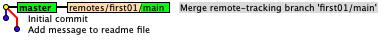
- 远端创建Beijing分支,将本地Beijing分支的内容push到远端的Beijing分支
    ```
    git fetch first01
    git checkout -b Beijing first01/Beijing
    git branch -av

    vi readme
    git status
    git add readme 
    git commit -m 'Beijing is big'
    
    vi readme 
    git commit -am 'Beijing historical of places'
    
    vi readme 
    git commit -am 'Beijing is watermelons'
    ```
    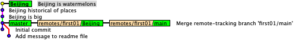
    ```
    # 等同于git push first01 Beijing:Beijing
    git push first01
    ```
    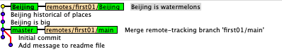
    
- 创建b标签并推送到远端
    ```
    git branch -av
    git tag -a b 5c3a047 -m 'tag of Beijing'
    git branch -av
    git tag --list
    git push first01 b
    ```

##### <span style="color:red" id='72'>在Github中,将Beijing这个分支合入到main主干中.</span>
- (对远程进行的操作,暂且对Git客户端没有影响的啦)
- Pull requests -> New pull request -> `base:main <- compare:Beijing` -> Create pull request
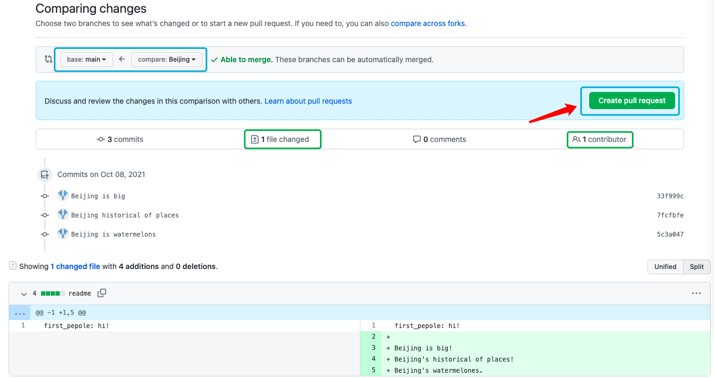
- 添加说明,为什么要做本次变更！
- Github会做检查,看是否可以做合并,若可以,会提供3种合并的策略. 
    -  Create a merge commit （当前选择第一种）
        - `Confirm merge` 背景色变为紫色表明merge成功！(不急着删除这个分支.)
        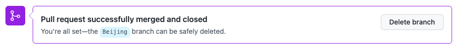  
        - 在main主干上创建了一个merge的commit
        - merge不管分支中间做了几个变更,当与其它分支做合并的时候,它会将前面所有commit的变更做一个统一的change set。因此在处理分支与分支的集成的时候,处理冲突它只需要处理一次就行！(所以有人会认为merge比rebase好用Hhhh)
        - 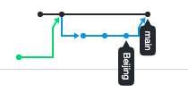
        - 
    -  Squash and merge
        - 先强制回退 `git push -f first01 master:main`  
        - `Confirm squash and merge` 背景色变为紫色
        - Beijing这一特性分支没有动,Github先找到main和Beijing共同的祖先,从这个点开始将Beijing分支的3个commit形成的Change Set==变更集==的==总和==放到了main最新的commit里面进而创建了一个新的commit(b573059)
            - 这种Squash的方式也能形成Linear线性的分支模式(对于主干而言).一没merge的节点,二将commit进行了一个整理.
            - 但是并不适用于任何的应用场景. 假设Beijing分支的三个commit是相互独立的(不是为了做一件事情的, 每个commit的功能点都比较完备),就没必要进行Squash.分成多个反而更容易进行跟踪
        - 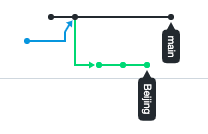
        - 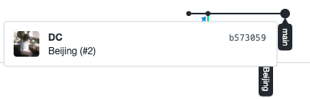
    -  Rebase and merge
        - 同理,先强制回退 `git push -f first01 master:main`
        - `Confirm rebase and merge` 背景色变为紫色
        - 将Beijing特性分支上的变更集一个一个的放到main主干后面.即从Beijing分支上把新增的commit的内容一个一个的复制到main分支上,创建一个个新的commit,但文件变更的内容与Beijing分支的commit是一样的.
        - 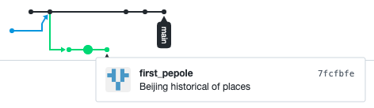
        - 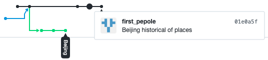
        - 从上图中对比,可以发现:**Squash更改了commit原作者(有点窃取劳动果实的意味),Rebase保留了commit原作者的信息。**

##### <span style="color:red" id='73'>Issues</span>
- 启用issue跟踪需求和任务
    - 进入项目 Settings -> Features -> 勾选Issues
        - 可设置`Set up templates`,设置完毕后,项目的目录上会出现.github/ISSUE_TEMPLATE
    - 可通过设置Labels标签对issues问题进行过滤
- 用project管理issue
    - 看板的应用 Projects -> Create a new project
    - 可进行拖拽;issue里的问题也可以放置到看板中

##### <span style="color:red" id='74'>项目内部实施code review</span>
- 进入项目 -> Settings -> Branches -> Add rule 
    - 不允许对main分支直接push
    - 通过pull request发起review的申请,可指定具体的review的人员（邮件通知）

##### <span style="color:red" id='75'>团队协作如何做多分支的集成？</span>
- 同理,先回退: `git push -f first01 master:main`
- 本地添加Shanghai分支+打标签's' 并同步到远端
    ```
    git checkout -b Shanghai master
    git log --all --oneline --graph
    vi readme 
    git commit -am 'Shanghai is modern'
    vi readme 
    git commit -am 'Shanghai is rainy'
    vi readme 
    git commit -am 'Shanghai with parks'
    vi readme 
    git commit -am 'Shanghai with musuems'
    
    git push first01
    
    DCdeMacBook-Air:GitHub_exercise One_Piece$ git log --oneline --graph --all
    * b17ec24 (HEAD -> Shanghai, first01/Shanghai) Shanghai with musuems
    * ef915e5 Shanghai with parks
    * 1bf9ed0 Shanghai is rainy
    * ce4a679 Shanghai is modern
    | * 5c3a047 (tag: b, first01/Beijing, Beijing) Beijing is watermelons
    | * 7fcfbfe Beijing historical of places
    | * 33f999c Beijing is big
    |/  
    *   5685fc2 (first01/main, master) Merge remote-tracking branch 'first01/main'
    |\  
    | * f4214d3 Initial commit
    * beffdfc Add message to readme file
    
    git tag -a s b17ec24 -m 'tag of Shanghai'
    git tag --list
    git push fist01 s
    git push first01 s
    ```
    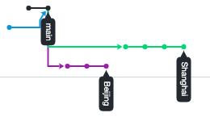
    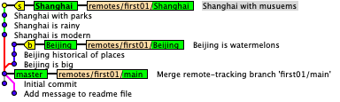
- 工作中,特性分支代表了不同功能的开发,总是有先有后的合入到集成分支里面,这里我们基于Github平台做集成(pull request)
- [ ] <span style="color:orange">merge commit </span>
    - 将Beijing分支通过merge的方式合入到main主干分支,main生成了一个merge的新commit！
        - 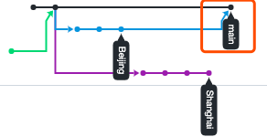 
    - 试图再将Shanghai分支合并到main主干中. 警告:'此分支存在必须解决的冲突.'(两分支都对文件的某一个区域做了改动) -> 在线解决冲突！-> Commit merge
        - 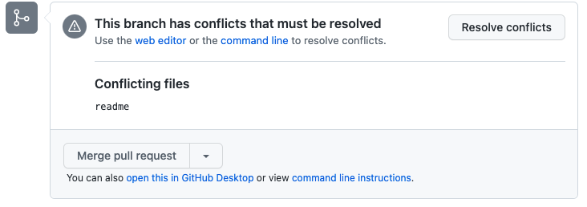
        - 
        - 原本Shanghai分支是生成四个commit的,现在github将main分支合入到了Shanghai,在Shanghai这个分支里将冲突解决掉！因而现目前main和Shanghai分支是fast-forword的关系！(main是Shanghai的祖父)
            - 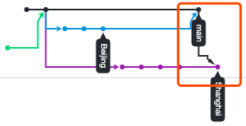
    - 解决完冲突后,继续pull request. `Confirm merge`
        - 这里选择的策略是创建一个merge的commit.
        - 即便此时main和Shanghai是fast-forword的关系.Github处理的时候,也没有将main分支直接指向Shanghai这个commit。
        - 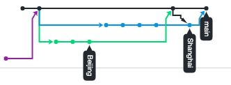 
    - 综上: 两个特性分支先后合并到main主干后,main主干上会新增两个merge commit(都具备两个parent commit).
- [ ] <span style="color:orange">Squash merge</span>
    - 先回退。git客户端的本地分支是没有做改动的,可以在git客户端往远端做强制的分支推送！
    ```
    # 让远端的main分支指向本地master的这个commit！
    git push -f first01 master:main
    git push -f first01 Shanghai:Shanghai
    ```
    - 将Beijing做的3个变更融合在一起,然后在main主干上新生成了一个commit！
        - 注意:Github还有一个处理机制 -> 它不会去改变特性分支的状况,除非是遇到了冲突这些不得已的情况(会往前摞一个commit)
        - 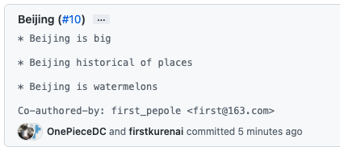
    - 再将Shanghai分支合并到main主干中！解决冲突后继续pull request！
        - 采用的squash的方式 main主干的commit的父级只有一个. 
        - 第3个箭头: 其实可以理解成,将Shanghai分支现目前所有的commit变更都加入到了main主干最后的那个commit里面。
        - 
- [ ] <span style="color:orange">Rebase merge</span>
    - 同理 先回退.略.
    - Beijing分支通过Rebase的策略往main合.
        - 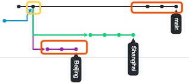 
    - 再试着将Shanghai分支合并到main中. 有冲突 -> 解决冲突.
        - Merge branch 'main' into Shanghai 
        - 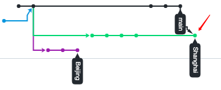
    - 冲突解决后,继续pull request？大人.时代变了.走不通了！！
        - 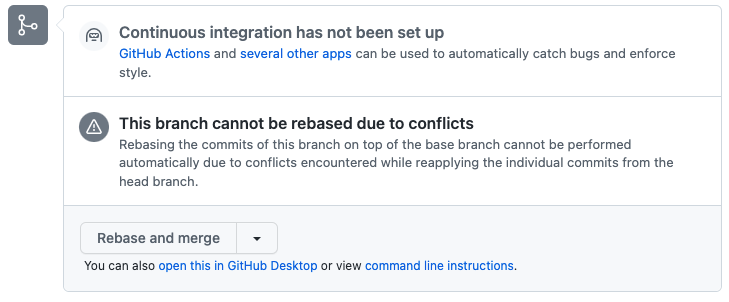
    - 保持Beijing分支合入到main,将Shanghai分支回退到试图合并前的状态.(因为想让Shanghai也通过rebase的方式合入main,Github搞不定！)
        - `git push -f first01 Shanghai:Shanghai` 
    - 自救: 在Git客户端,在本地,让Shangihai分支新增的commit基于远端的main分支进行变基操作.
        ```
        # 先将远端的main拉到本地去
        git fetch first01
        
        DCdeMacBook-Air:GitHub_exercise One_Piece$ git log --oneline --graph --all
        * 687dc18 (first01/main) Beijing is watermelons
        * 387b944 Beijing historical of places
        * 32542a5 Beijing is big
        | * b17ec24 (HEAD -> Shanghai, tag: s, first01/Shanghai) Shanghai with musuems
        | * ef915e5 Shanghai with parks
        | * 1bf9ed0 Shanghai is rainy
        | * ce4a679 Shanghai is modern
        |/  
        | * 5c3a047 (tag: b, first01/Beijing, Beijing) Beijing is watermelons
        | * 7fcfbfe Beijing historical of places
        | * 33f999c Beijing is big
        |/  
        *   5685fc2 (master) Merge remote-tracking branch 'first01/main'
        |\  
        | * f4214d3 Initial commit
        * beffdfc Add message to readme file
        ```
        ```
        # 切换到需要变基的Shanghai分支
        git checkout Shanghai
        # 会报 有冲突！
        git rebase first01/main
        # 进入冲突文件 解决冲突
        vi readme
        ```
        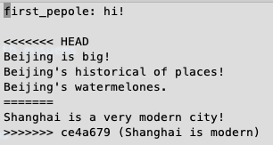
        ```
        git add .
        DCdeMacBook-Air:GitHub_exercise One_Piece$ git rebase --continue
        [分离头指针 bc124bb] Shanghai is modern
         1 file changed, 2 insertions(+)
        成功变基并更新 refs/heads/Shanghai
        
        DCdeMacBook-Air:GitHub_exercise One_Piece$ git status
        位于分支 Shanghai
        无文件要提交，干净的工作
        ```
        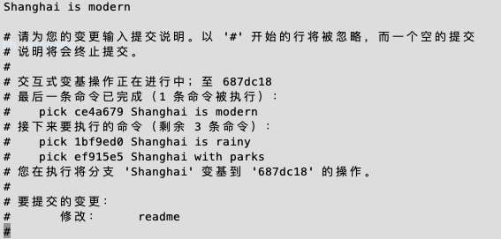
        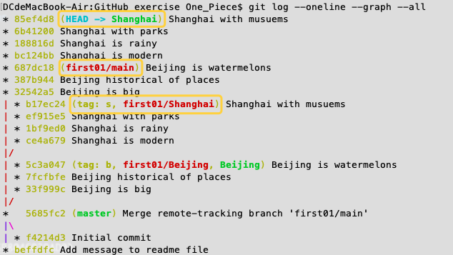
        ```
        # 强制推送
        git push -f first01 Shanghai:Shanghai
        ```
        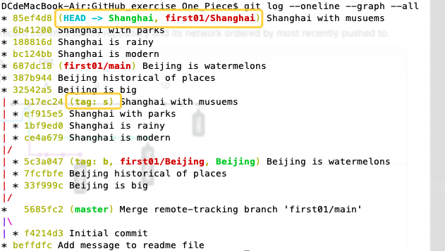
        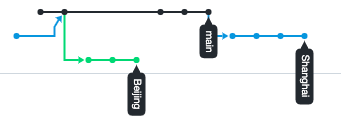
    - 最后,在github上pull request（rebase的策略）
        - Shanghai向main发起merge申请,且策略是rebase的时候,它并没有将main的指针直接(f-f的方式)指向Shanghai.(避免丢失提交者的信息)
        - 
        - 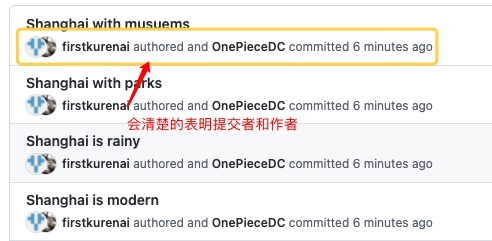
- [ ] <span style="color:orange">Rerere</span>
    - 参考资料:`https://git-scm.com/book/zh/v2/Git-%E5%B7%A5%E5%85%B7-Rerere`

##### <span style="color:red" id='76'>其它</span>
- 如何保证集成的质量？
    - `https://github.com/marketplace` 
    - Continuous integration持续集成:在将代码推送到 GitHub 时自动构建和测试代码，防止将错误部署到生产环境中。
- 如何将产品包发布到Github上？
    - Github上releases的功能: 待集成分支满足一定的质量要求后,创建出来的产品包需要以二进制压缩包的形式扔到Github上,便于拉到测试环境去使用。
        - 通过相应的CI服务实现,按照规则写好配置文件和部署脚本 eg:`.travis.yml`
- 给项目增加详细的指导文档
    - Wiki功能. 从Github仓库中挑选写的好的wiki,然后放到我们自己的功能里面,再通过Edit的方式进行学习修改.

---

## <span id="8">GitLab实践</span>
- 功能:`https://about.gitlab.com/devops-tools/`
- CI/CD
- 将gitlab上的工程经过自动打包自动发布到公有云AWS上面去.

---

## 补充: vscode使用Github
- 在电脑上配置安装git环境 (速度慢-P2P软件下载)
- 翻墙登陆github给vscode授权

